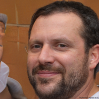
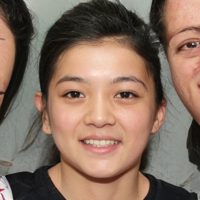

# Don Antonio Suárez
### Valencia:  16°C 🌤️
## Desarrollador web
## Frase del día:
<!-- START QUOTE -->
### Sacar provecho de un buen consejo exige más sabiduría que darlo.
**John Churton Collins** *(1848-1908) Crítico literario inglés.*
<!-- END QUOTE -->

## Personas felices de lo bien que hago mi trabajo:

  
   
  

  
   
  

