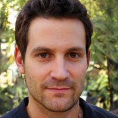

# Don Antonio Suárez
### Valencia:  24°C 🌡️
## Desarrollador web
## Frase del día:
<!-- START QUOTE -->
### Nunca hay que dejarse dominar, incluso cuando crees que el otro sabe lo que más te conviene.
**Paul Auster** *(1947-2024) Novelista y poeta estadounidense.*
<!-- END QUOTE -->

## Personas felices de lo bien que hago mi trabajo:

  
   
  

  
   
  

