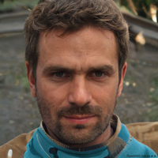

# Don Antonio Suárez
### Valencia:  23°C 🌡️
## Desarrollador web
## Frase del día:
<!-- START QUOTE -->
### Quitad de los corazones el amor por lo bello, y habréis quitado todo el encanto a la vida.
**Jean Jacques Rousseau** *(1712-1778) Filósofo francés.*
<!-- END QUOTE -->

## Personas felices de lo bien que hago mi trabajo:

  
   
  

  
   
  

